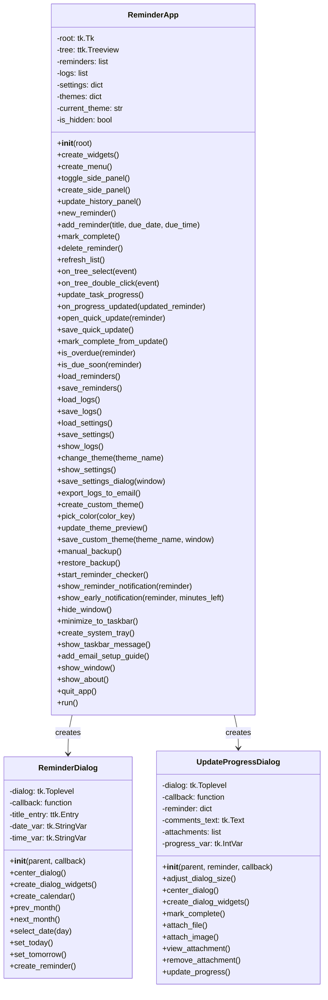
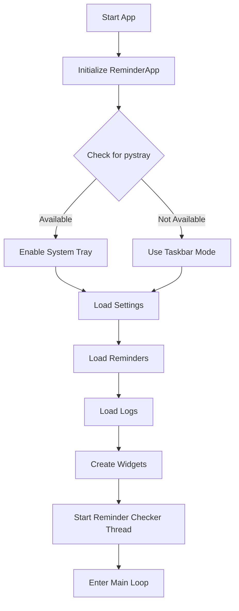
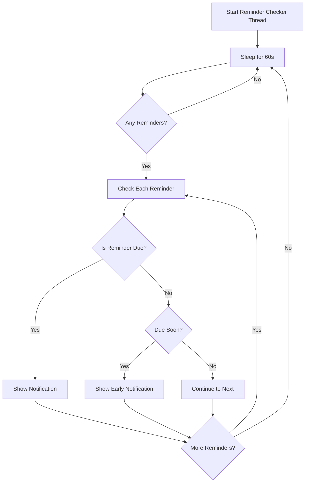
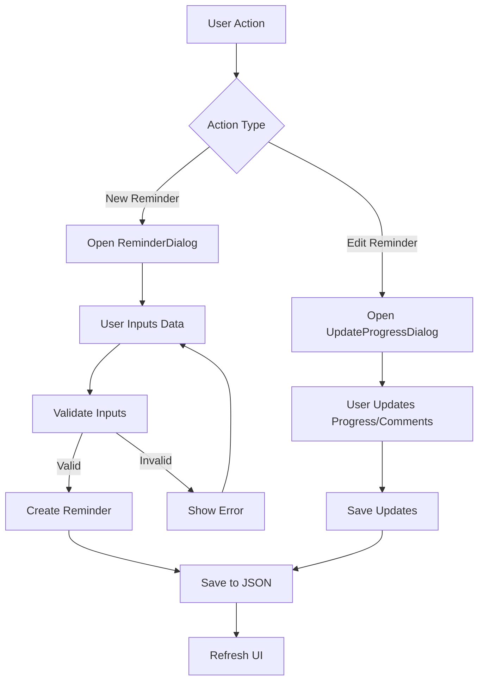

# Reminder App Implementation Details

This document provides a comprehensive technical overview of the Reminder App implementation, detailing the core classes, methods, data structures, and program flow.

## Application Architecture

The Reminder App follows a single-module architecture with multiple interrelated classes. The application is built using Python's tkinter library for the GUI components and uses native Python functionality for threading, file I/O, and date handling.

## Class Structure

### Mermaid Class Diagram



## Program Flow

### Main Application Startup Sequence



### Reminder Checking Flow



### Add/Edit Reminder Flow



## Core Functions Documentation

### ReminderApp Class

#### Initialization and Setup Functions

##### `__init__(self, root)`
- **Purpose**: Initializes the main application
- **Parameters**: 
  - `root`: The main tkinter root window
- **Actions**:
  - Sets up main window properties
  - Initializes data structures for reminders, logs, and settings
  - Sets file paths for JSON storage
  - Configures themes
  - Detects pystray availability for system tray support
  - Loads settings, reminders, and logs
  - Creates GUI widgets
  - Starts reminder checker thread

##### `create_widgets(self)`
- **Purpose**: Creates the main GUI components
- **Key components created**:
  - Main frame with padding
  - Toolbar with action buttons
  - Treeview for reminders list with columns
  - Status bar with app information
  - Side panel for progress tracking (initially hidden)

##### `create_menu(self)`
- **Purpose**: Creates the application menu bar
- **Menu structure**:
  - File menu (New Reminder, Backup, Exit options)
  - View menu (Logs, Theme options)
  - Tools menu (Settings, Export)
  - Help menu (Guide, About)

##### `create_side_panel(self)`
- **Purpose**: Creates collapsible side panel for progress tracking
- **Components**:
  - History tracking with updates timeline
  - Progress visualization for selected reminder
  - Update action buttons

#### Reminder Management Functions

##### `new_reminder(self)`
- **Purpose**: Opens the new reminder dialog
- **Actions**: Creates and shows a ReminderDialog instance

##### `add_reminder(self, title, due_date, due_time)`
- **Purpose**: Adds a new reminder to the list
- **Parameters**:
  - `title`: Reminder title/description
  - `due_date`: Due date in YYYY-MM-DD format
  - `due_time`: Due time in HH:MM format
- **Actions**:
  - Creates a reminder dictionary with metadata
  - Adds to reminders list
  - Saves to JSON
  - Refreshes UI

##### `mark_complete(self)`
- **Purpose**: Marks selected reminder as complete
- **Actions**:
  - Gets selected reminder
  - Sets status to "Completed"
  - Adds completion timestamp
  - Moves to logs
  - Removes from active reminders
  - Saves both files
  - Refreshes UI

##### `delete_reminder(self)`
- **Purpose**: Deletes selected reminder
- **Actions**:
  - Confirms action with user
  - Removes reminder from list
  - Saves to JSON
  - Refreshes UI

##### `refresh_list(self)`
- **Purpose**: Refreshes the reminders list in the UI
- **Actions**:
  - Clears existing items
  - Sorts reminders by date/time
  - Adds each reminder with appropriate formatting
  - Sets color coding based on status

##### `update_task_progress(self)`
- **Purpose**: Opens progress update dialog for selected task
- **Actions**:
  - Gets selected reminder
  - Shows visual feedback (flashing)
  - Opens UpdateProgressDialog

##### `on_progress_updated(self, updated_reminder)`
- **Purpose**: Callback when progress is updated
- **Parameters**:
  - `updated_reminder`: The updated reminder dictionary
- **Actions**:
  - Finds and updates reminder in list
  - Saves to JSON
  - Refreshes UI
  - Shows confirmation

#### File Operations

##### `load_reminders(self)`
- **Purpose**: Loads reminders from JSON file
- **Recovery features**:
  - Tries main file first
  - Falls back to backup if main file missing
  - Updates reminder format if needed

##### `save_reminders(self)`
- **Purpose**: Saves reminders to JSON file
- **Safety features**:
  - Creates backup before saving
  - Uses proper JSON formatting

##### `load_logs(self)`
- **Purpose**: Loads completed task logs from JSON
- **Actions**: Deserializes JSON to list

##### `save_logs(self)`
- **Purpose**: Saves completed task logs to JSON
- **Actions**: Serializes list to JSON

##### `load_settings(self)` and `save_settings(self)`
- **Purpose**: Load/save application settings
- **Actions**: Manages user preferences in JSON format

##### `manual_backup(self)`
- **Purpose**: Creates a manual backup of data
- **Actions**:
  - Shows file dialog
  - Copies data file to selected location

##### `restore_backup(self)`
- **Purpose**: Restores data from backup file
- **Actions**:
  - Shows file dialog
  - Loads data from selected backup
  - Saves to main data file
  - Refreshes UI

#### UI and Interaction

##### `on_tree_select(self, event)`
- **Purpose**: Handles treeview selection
- **Actions**:
  - Updates side panel with selected reminder
  - Shows details in history panel

##### `on_tree_double_click(self, event)`
- **Purpose**: Handles double-click on tree item
- **Actions**: Opens quick update window for selected reminder

##### `open_quick_update(self, reminder)`
- **Purpose**: Opens floating window for quick updates
- **Components**:
  - Title and task info
  - Progress slider
  - Comments field
  - Action buttons

##### `show_logs(self)`
- **Purpose**: Shows completed task logs window
- **Components**:
  - Treeview with completed tasks
  - Sorted by completion date (newest first)

##### `change_theme(self, theme_name)`
- **Purpose**: Changes application theme
- **Parameters**:
  - `theme_name`: Name of theme to apply
- **Actions**:
  - Updates UI colors based on theme

##### `show_settings(self)`
- **Purpose**: Shows settings dialog
- **Components**:
  - Tabbed interface for different settings
  - Notification settings
  - Email configuration

##### `show_reminder_notification(self, reminder)`
- **Purpose**: Shows notification for due reminder
- **Actions**:
  - Displays message box
  - Brings window to front if hidden

##### `show_early_notification(self, reminder, minutes_left)`
- **Purpose**: Shows early notification before due time
- **Parameters**:
  - `reminder`: Reminder to notify about
  - `minutes_left`: Minutes until due time
- **Actions**: Shows message box with time remaining

#### Background Operation

##### `start_reminder_checker(self)`
- **Purpose**: Starts background thread for checking reminders
- **Actions**:
  - Creates daemon thread
  - Checks reminders every 60 seconds
  - Shows notifications for due reminders

##### `hide_window(self)`
- **Purpose**: Hides window to system tray/taskbar
- **Actions**:
  - Withdraws main window
  - Creates system tray icon or taskbar presence

##### `create_system_tray(self)`
- **Purpose**: Creates system tray icon (if pystray available)
- **Components**:
  - Tray icon with menu
  - Options for show/hide/quit

##### `minimize_to_taskbar(self)`
- **Purpose**: Creates minimal taskbar presence
- **Actions**:
  - Creates minimal window
  - Shows taskbar message about background operation

##### `show_window(self)`
- **Purpose**: Shows window from system tray/taskbar
- **Actions**:
  - Restores main window
  - Cleans up taskbar window or tray icon

##### `quit_app(self)`
- **Purpose**: Quits the application completely
- **Actions**:
  - Confirms with user
  - Exits application

### ReminderDialog Class

#### Core Functions

##### `__init__(self, parent, callback)`
- **Purpose**: Initializes new reminder dialog
- **Parameters**:
  - `parent`: Parent window
  - `callback`: Function to call with new reminder data
- **Actions**:
  - Creates dialog window
  - Sets up widgets
  - Centers dialog on parent

##### `create_dialog_widgets(self)`
- **Purpose**: Creates dialog widgets
- **Components**:
  - Title input
  - Date selection with calendar
  - Time input
  - Action buttons

##### `create_calendar(self)`
- **Purpose**: Creates interactive calendar widget
- **Features**:
  - Month navigation
  - Day selection
  - Current date highlighting

##### `create_reminder(self)`
- **Purpose**: Creates the reminder from user input
- **Actions**:
  - Validates inputs
  - Calls callback with reminder data
  - Closes dialog

### UpdateProgressDialog Class

#### Core Functions

##### `__init__(self, parent, reminder, callback)`
- **Purpose**: Initializes update progress dialog
- **Parameters**:
  - `parent`: Parent window
  - `reminder`: Reminder to update
  - `callback`: Function to call with updated data
- **Actions**:
  - Creates dialog window
  - Sets up widgets
  - Centers dialog

##### `adjust_dialog_size(self)`
- **Purpose**: Calculates appropriate dialog size
- **Actions**:
  - Gets required size for widgets
  - Sets optimal window dimensions
  - Limits to screen constraints

##### `create_dialog_widgets(self)`
- **Purpose**: Creates dialog widgets
- **Components**:
  - Task info
  - Comments text area
  - File attachments section
  - Progress slider
  - History section
  - Action buttons

##### `mark_complete(self)`
- **Purpose**: Marks task as complete from update dialog
- **Actions**:
  - Sets status to completed
  - Sets progress to maximum
  - Adds completion timestamp
  - Calls callback with updated data

##### `update_progress(self)`
- **Purpose**: Updates reminder progress and comments
- **Actions**:
  - Gets current values
  - Updates reminder data
  - Adds to update history
  - Calls callback with updated data

##### `attach_file(self)` and `attach_image(self)`
- **Purpose**: Attach files or images to reminder
- **Actions**:
  - Shows file dialog
  - Adds attachment metadata
  - Updates UI

## Data Structures

### Reminder Object Structure

```json
{
  "title": "Task title",
  "due_date": "YYYY-MM-DD",
  "due_time": "HH:MM",
  "status": "Pending|Completed|Notified",
  "created": "ISO timestamp",
  "comments": "User comments",
  "progress": 0-10,
  "completed_at": "ISO timestamp (if completed)",
  "updates": [
    {
      "timestamp": "ISO timestamp",
      "progress": 0-10,
      "comment": "Update comment",
      "action": "progress_update|completion|floating_update",
      "has_attachments": true|false
    }
  ],
  "attachments": [
    {
      "path": "file_path",
      "name": "file_name",
      "size": file_size_bytes,
      "type": "document|image|file",
      "added_on": "ISO timestamp"
    }
  ]
}
```

### Settings Object Structure

```json
{
  "notification_minutes_before": 15,
  "email_settings": {
    "smtp_server": "smtp.example.com",
    "smtp_port": 587,
    "email": "user@example.com",
    "password": "app_password"
  },
  "custom_themes": {
    "theme_name": {
      "bg": "#FFFFFF",
      "fg": "#000000",
      "selectbackground": "#0078D4",
      "selectforeground": "#FFFFFF",
      "button_bg": "#F0F0F0",
      "button_fg": "#000000"
    }
  }
}
```

## File Storage

### Files and Their Purpose

1. **reminders.json**
   - Primary data storage
   - Contains active reminders
   - Loaded at startup, saved after changes

2. **reminders_backup.json**
   - Automatic backup copy
   - Created before each save operation
   - Used for recovery if main file is corrupted

3. **reminder_logs.json**
   - Stores completed reminders history
   - Maintains completion timestamps
   - Never automatically deleted

4. **settings.json**
   - Stores user preferences
   - Theme selection
   - Notification timing
   - Email configuration

## Threading Model

### Main Thread
- Handles UI operations
- Responds to user input
- Updates display

### Background Thread
- Runs reminder checker
- Sleeps 60 seconds between checks
- Signals main thread for notifications via `root.after()`

## Implementation Decisions

### GUI Framework
- **tkinter** was chosen for:
  - Standard library inclusion
  - Cross-platform compatibility
  - Low resource usage
  - Simplicity of implementation

### Data Storage
- **JSON format** was chosen for:
  - Human readability
  - No database dependency
  - Easy backup/restore
  - Simple versioning

### Threading Approach
- **Daemon thread** for background checking:
  - Terminates automatically when main thread exits
  - No complex shutdown procedures needed
  - Simple periodic checking model

### System Tray Implementation
- **Optional pystray dependency**:
  - Provides enhanced system tray integration when available
  - Falls back to taskbar minimization when not available
  - Non-blocking operation in both modes

## Performance Considerations

### Optimizations
- Periodic checking (60s intervals) to minimize CPU usage
- Lazy loading of UI elements (side panel)
- Efficient JSON serialization/deserialization
- Minimal file I/O operations

### Resource Usage
- Memory footprint: ~25-30MB
- CPU usage: <1% when idle, brief spikes during updates
- Disk I/O: Only during save operations

## Error Handling

### Key Error Handling Approaches
- Graceful degradation for missing features
- Automatic recovery from data corruption
- User-friendly error messages
- Exception catching with fallback behavior

### Data Integrity Protection
- Backup before save operations
- Validation before committing changes
- Safe JSON serialization practices

## Testing Approach

### Test Cases
- Data saving/loading
- UI responsiveness
- Notification timing
- Theme application
- Date/time validation
- Backup/restore functionality

## Extension Points

### Adding New Features
- Modular class design allows for extension
- New dialog classes can be added
- Additional data fields can be added to reminder structure

### Customization Options
- Theme system extensible for new color schemes
- Settings framework can accommodate new preferences
- Dialog layouts follow consistent pattern for extension
